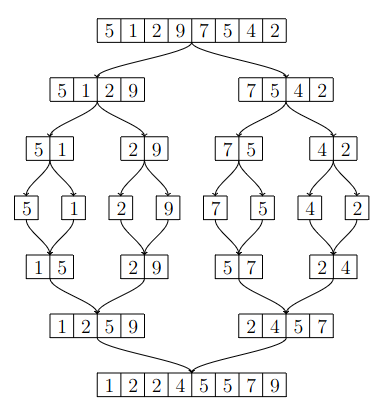

# Merge sort

_Merge sort_ is an efficient sorting algorithm with time complexity $$O(n \log n)$$.

The algorithm uses recursion to first sort the first half and the second half of the list separately. Then it merges the two sorted halfs into the full sorted list. Once the two halfs are sorted, the merging can be implemented efficiently.

Recursion is used so that the algorithm calls itself to sort the two list halfs. The recursion ends when the list has only one element remaining, since a one element list is already in order.

## Example

The following picture illustrates merge sort on the list $$[5,1,2,9,7,5,4,2]$$.



## Implementation

Merge sort can be implemented in Python as follows:

```python
def merge_sort(items):
    n = len(items)

    if n <= 1: return

    left = items[0:n//2]
    right = items[n//2:]

    merge_sort(left)
    merge_sort(right)

    a = b = 0
    for i in range(n):
        if b == len(right) or \
           (a < len(left) and left[a] < right[b]):
            items[i] = left[a]
            a += 1
        else:
            items[i] = right[b]
            b += 1
        
numbers = [5, 2, 4, 2, 6, 1]
merge_sort(numbers)
print(numbers) # [1, 2, 2, 4, 5, 6]
```

The function `merge_sort` sorts the given list using merge sort. If the list has at most one element, the function does nothing. Otherwise, the function splits the list into two halfs `left` and `right` and sorts them recursively.

After sorting the two halfs, the algorithms constructs the full sorted list. To do this, the algorithm goes through the positions of the list from left to right and fills each position with the smallest remaining element from the lists `left` and `right`. Since the two half lists are already in order, the smallest remaining element in each is found efficiently.

Notice that the above function `merge_sort` is intended for illustrating how merge sort works and not as an example of the best way to implement sorting in Python. It is better to use the built-in implementations `sort` and `sorted` in Python.

## Efficiency

The time complexity $$O(n \log n)$$ of merge sort comes from the facts that there are $$O(\log n)$$ levels of recursion and that the merging on each level takes $$O(n)$$ time. The number of recursion levels is $$O(\log n)$$, because when a list of length $$n$$ is halved $$\log n$$ times, the list has only one element remaining and the recursion ends.

The merging on each level happens as follows:

* On the level 1, two lists of length $$n/2$$ are merged into one list of length $$n$$.
* On the level 2, four lists of length $$n/4$$ are merged into two lists of length $$n/2$$.
* On the level 3, eight lists of length $$n/8$$ are merged into four lists of length $$n/4$$.
* etc.

The total number of elements processed at each level is $$O(n)$$, and thus the merging time per level is $$O(n)$$.
